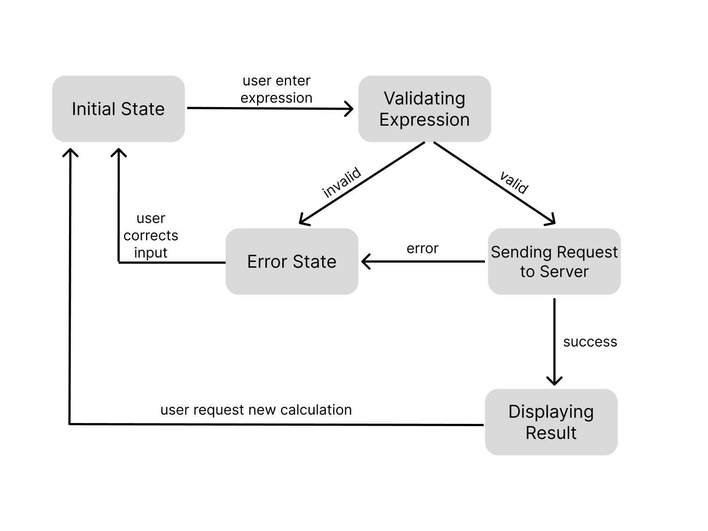

# calculator-vodovoz-tv

## What Has Been Done
This project is a comprehensive server application written in Python that facilitates user interaction with a calculator through HTTP requests and WebSocket connections. The server processes arithmetic expressions and returns the calculated results while also maintaining a history of calculations in a database.

The application supports the following operators for integer calculations: +, -, *, /, (, and ). Users can submit expressions, and the server efficiently processes these inputs, returning the calculated results. Additionally, the server is designed to handle multiple simultaneous connections, ensuring a responsive experience for all users. It also automatically sends updates and the history of calculations to connected clients in real-time, enhancing the overall functionality of the application.

## How to Run/Use It

**Operating System:**  
Ubuntu version 22 or higher.  
**Python Version:**  
Python version 3.10 or higher.

To run the project, navigate to the project directory in your terminal:

```bash
   cd ~/calculator-vodovoz-tv
```
You need to install neccessary instruments, follow commands:
```bash
   sudo apt install python3
```
and
```bash
   sudo apt install python3.10-venv
```
At first, you should write the following command:
```bash
   make clean && make all
```
To start the server, use the following command:
```bash
   make run-server
```
To start the client, you should open **new** terminal and use the following command:
```bash
   make run-client
```
You can run more than one client. Just open new terminal for each new client.

## How It's Made

The system consists of the following main components:  

**Database Setup:**  
The database is implemented using aiosqlite, which stores the history of calculations, including expressions, results, and timestamps. This allows for efficient retrieval and management of calculation data.

**Asynchronous Server:**  
The server is implemented in server.py using aiohttp, enabling asynchronous request handling. This setup allows the server to listen on a specified port and process multiple connections simultaneously, improving overall performance.

**WebSocket Integration:**  
The server is equipped with WebSocket functionality, allowing it to maintain persistent connections with clients. This enables the automatic sending of calculation history and real-time updates to all connected clients.

**Request Handling:**  
The server processes incoming requests and returns responses based on the results of the calculator. It efficiently manages interactions with the calculator program, handling return codes and results asynchronously.

**Error Handling:**  
The server includes robust error management for various scenarios, such as timeouts and error messages, ensuring a smooth user experience.

## Daily Task Report - server

### DZTVP-4 (07/03/2025)
**Task**:  
Set up the development environment for the Python server.  
**Results**:  
Successfully installed Python and verified that all necessary libraries (e.g., `json`, `subprocess`) are available. The development environment is now fully prepared for further development.

### DZTVP-5 (07/03/2025)
**Task**:  
Create the basic structure of the server.  
**Results**:  
Created the `server.py` file and set up a basic HTTP server that listens on the specified port. Implemented a handler for the root URL, which successfully returns "Hello, World!" when accessed. The server structure is now in place for handling requests.

### DZTVP-6 (08/03/2025)
**Task**:  
Implement interaction with the calculator.  
**Results**:  
Developed a function to run the calculator and handle its results effectively. The function manages return codes as follows:
  - Successfully retrieves the result when the return code is 0.
  - Returns an appropriate error message when the return code is not 0.
  - Provides a message indicating that the result was not obtained if the return code is 0 but the result is missing.
  - Implemented timeout handling for the calculator execution, ensuring that errors are returned if the execution exceeds the specified time limit.

### DZTVP-7 (08/03/2025)
**Task**:  
Implement server response generation based on calculator results.  
**Results**:  
The server now generates responses based on the results from the calculator:
  - Returns a response with code 200 and the result if the request is valid and the calculator returns a result.
  - Returns a response with code 500 and an error message if the request is valid but the calculator returns an error.
  - Returns a response with code 200 if the request is valid but the result is missing. This ensures clear communication of the server's status to the client.

### DZTVP-8 (08/03/2025)
**Task**:  
Implement logging using `structlog`.  
**Results**:  
Successfully set up a logging system for the Python server using the `structlog` library. The logging is organized and formatted for clarity, including:
  - Informative logs that are easy to read, with timestamps, log levels, and messages.
  - Implementation of JSON logging for easier monitoring and analysis, enhancing the server's observability and debugging capabilities.
  
## Daily Task Report - gui

### DZTVP-11 (19/03/2025)
**Task**:  
Implement a mathematical expression validator.  
**Results**:  
Successfully created the `MathExpressionValidator` class to check the validity of input mathematical expressions. The implementation includes:
  - Validation of allowed characters to ensure only valid symbols are processed.
  - Checking for balanced parentheses to prevent syntax errors in expressions.

### DZTVP-12 (19/03/2025)
**Task**:  
Create a class for handling calculations in a separate thread.  
**Results**:  
Implemented the `CalculationWorker` class to perform calculations in a separate thread. The class effectively handles:
  - Successful and error responses from the server, ensuring smooth communication between threads.
  - Use of signals to transmit data back to the main thread, enhancing the responsiveness of the application.

### DZTVP-13 (19/03/2025)
**Task**:  
Develop the main application window.  
**Results**:  
Created the `CalculatorClient` class to represent the main application window. The implementation includes:
  - A user-friendly interface with controls for inputting expressions, buttons for operations, and displays for results and error messages.
  - Event handling for buttons and other controls, ensuring a responsive and interactive user experience.  
  
So, we have v1.0 version of project.
  
## Daily Task Report - project v2.0

### DZTVP-15 (24/03/25)
**Task:**  
Create a database to store the history of calculations.  
**Results:**  
Developed a database using aiosqlite that stores all calculations, including expressions, results. Key achievements include:
  - Created a table structure to store calculation data with the necessary fields.
  - Implemented asynchronous functions for adding new records and retrieving calculation history.

### DZTVP-16 (24/03/25)
**Task:**  
Modify the server to be asynchronous and implement a WebSocket mechanism.  
**Results:**  
The server was rewritten to be asynchronous using aiohttp. Configured WebSocket connections to automatically send calculation history to clients, ensuring data relevance.

### DZTVP-17 (24/03/25)
**Task:**  
Implement "thick" clients with a PUSH approach.  
**Results:**  
Developed clients capable of receiving updates from the server without the need to send requests
 
## Finite State Machine for Calculator


### States
- **Initial State**:  
The initial state when the application is ready for input.
- **Validating Expression**:  
The state where the application checks the entered mathematical expression.
- **Error State**:  
The state where the application displays an error message.
- **Sending Request to Server**:  
The state where the application sends a request to the server for calculation.
- **Displaying Result**:  
The state where the application displays the result of the calculation.

### Transitions
**Initial State**:
User enters expression → Transition to Validating Expression state.

**Validating Expression**:
Valid → Transition to Sending Request to Server state.  
Invalid → Transition to Error State.

**Error State**:
User corrects input → Transition back to Initial State.

**Sending Request to Server**:
Success → Transition to Displaying Result state.  
Error → Transition to Error State.

**Displaying Result**:
User requests new calculation → Transition back to Initial State.

